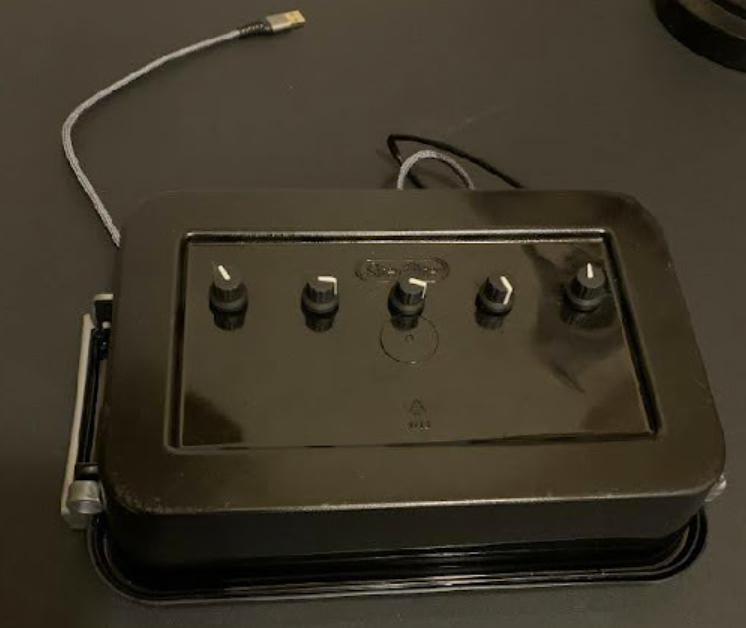

# Future Hardware Development

## Additional Inputs

Currently, the simulation takes 4 inputs:

- Y-axis adjustment to adjust bombsight up and down
- ATF adjustment to adjust the actual time of fall value
- Trail adjustment to adjust the trail value
- Rate adjustment to adjust the rate value

In the future, additional inputs to create are:

- X-axis adjustment for lining up target if plane is not centered (due to wind)
- Turn and drift knobs for wind effects
- Extended Vision Knob for going above 70 degrees view angle

The main reasoning behind the additional development pieces is to include the wind factor. Initially, the influence of wind was out-of-scope for the project. Therefore, it is necessary to implement later to complete the bombsight simulation. Please reference pages 12-16, 29-30, 60-62, 154-156, and 196-197 of the bombing book provided by the Museum of World War II Aviation in Colorado Springs to get all information needed to implement wind. It will be up to the designers to understand and to design a means to implement aspects of the wind influence such as:

- Plane course correction
- Plane drift angle
- Difference between plane heading and course
- Cross trail and RCCT

### Magnification

When the simulation is setup for fullscale (i.e. fudge factor = 1), it is hard to see the target at 14000 ft. Therefore, it is recommended that a magnification funciton be implemented. This can be done in software or there can be an additional input encoder to complete this action.

## Integrate into Bombsight

As of the creation of these documents, the user inputs are contained in an external box to the Norden Bombsight replica. 

To fully finish the Norden Bombsight piece, it will be necessary to integrate the trinkey hardware into the bombsight. Please acknowledge how the bombsight looks at page 153 of the bombing book provided by the Museum of World War II Aviation in Colorado Springs to complete the aesthetics of the Norden.

## Additional Outputs

For an additional piece, within the simulation, calculations are made for the drop angle and the line of sight angle. In the real Norden, these values are resembled as lever arms that moved. When these levers met, the Norden would release the bombs automatically. 

Therefore, for the full norden experience, it is recommended that the angles from the simulation be outputted to something such as an arduino that can control some motors to move lever arms as described.

## Future Trinkey Updates

In the future, since trail and ATF were absolute position knobs, it is recommend to switch these knobs to absolute position encoders instead of the incremental encoders. As of the creation of these documents, all encoders are incremental. Therefore, they rotate endlessly and keep incrementing/decrementing. 

On the bombsight, the trail and ATF would be read as values for disc speed and mils. These were absolute measurements; therefore, absolute position encoders should be used to detail the exact rotation on the circle that the encoder is at. This will take time to implement as Unreal is not extremely friendly with things that are not keyboards nor mice. However, it can be done, and the Unreal Engine Documentation should be referenced heavily. For input values of trail and ATF, please reference page 6-11 in the bombing book provided by the Museum of World War II Aviation in Colorado Springs.

## The Bombing Book

This will be re-iterated numerous times. Please take a look at the bombing book provided by the Museum of World War II Aviation in Colorado Springs. This is the source of all information leveraged in initial development. It will be confusing, but it is up to the designer to understand it for full implementation of the Norden Bombsight. Additional features for future development can be found throughout. 
