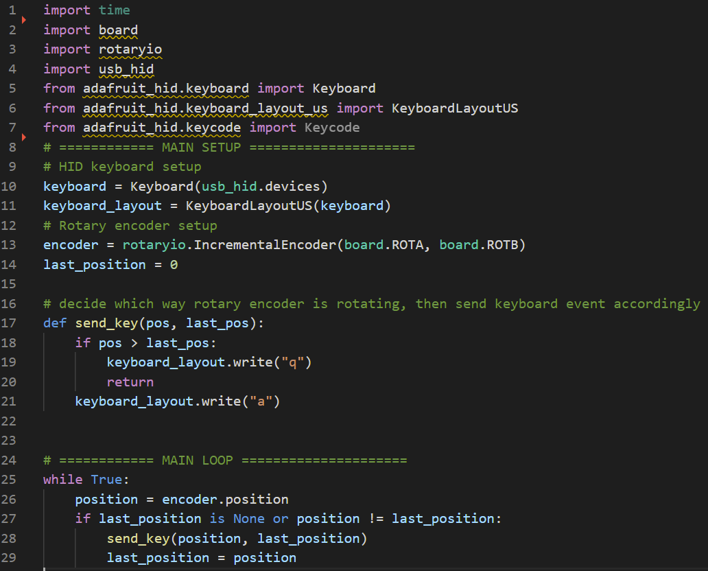

# Trinkey Rotary Encoder Setup

## Setting up a new device
- Official documentation on the rotary trinkey devices for setup can be found here: [Adafruit Trinkey circuitpython](https://learn.adafruit.com/adafruit-rotary-trinkey/circuitpython)
- Download circuit python [Circuit python download](https://learn.adafruit.com/welcome-to-circuitpython/installing-circuitpython)
    - CircuitPython Verson: 7.2.5 as of the release of these documents
- When first plugging in the device, you should see it show up as a drive named 'TRINKEYBOOT'
    - If you do not see TRINKEYBOOT, double tap the red reset button on the bottom of the device.
- Copy and paste the `.uf2` circuit python download into the TRINKEYBOOT drive.
    - You can locate this file on the Adafruit Trinkey CircuitPython documentation above
- You should now see a drive called 'CIRCUITPY'

## Circuit python
- Rotary encoders are programmed in circuit python.
- Devices are setup to act as a keyboard in order to get input into the unreal game.
- To achieve this, we are using the HID python library.
- See the code.py files in this directory for the exact implementation.

To change the program, follow these steps:
1. Write your new circuit python program.
2. Delete code.py from the 'CIRCUITPY' drive.
3. Copy and paste your new program into the 'CIRCUITPY' drive. Make sure it is named 'code.py'.

Alternatively, you can use adafruit's circuit python editor called MU. [Adafruit MU editor](https://learn.adafruit.com/adafruit-rotary-trinkey/installing-mu-editor)

- If the program uploads successfully, you will see a green light flash at the bottom of the board.
- If your program fails to upload or errors during runtime, you will see a red light flash at the bottom of the board.
- Mu Version: 1.1.1

## Current CircuitPython

The current version of the circuit python code uploaded to the Trinkey's is located within the repo that houses this document page: 
- repo: https://github.com/JulesVerne22/Bombgineers-Docs/
- path: /pages/Development-Docs/Hardware/rotary-encoders

Below is an image of the code to look for.

