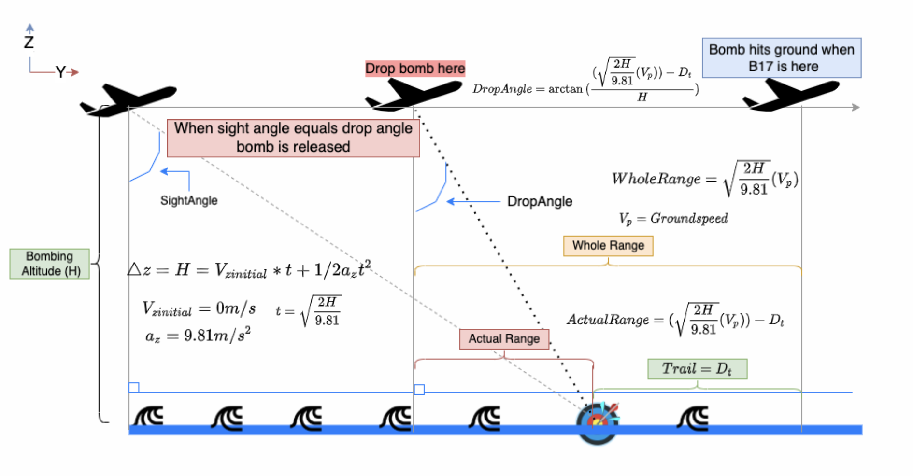
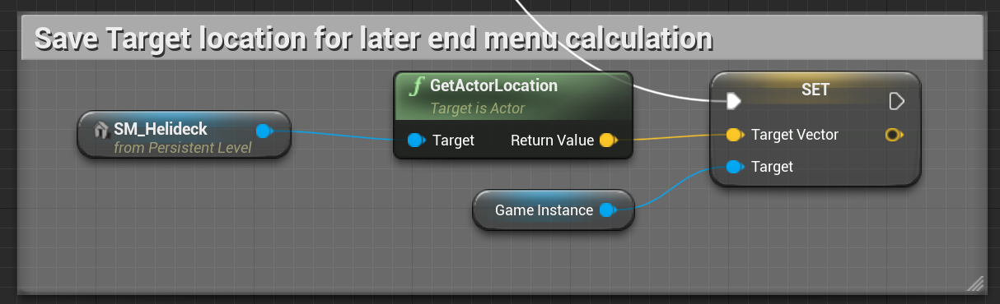
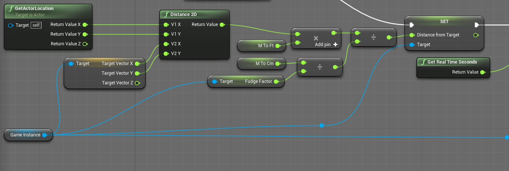

# Information Docs

This contains some useful information for understanding the premise of a few of the calculations made within the software. 

## Bomb Drop Physics

For our system, we had to analyze how the bombsight works. What inputs did we need from the user for the hardware and what inputs we need in the simulation along with how they are going to impact the simulation. This is where some bombing physics come into play. 

For a typical bombing run with no wind, the plane will fly in a straight line over the target. The bombardier would move the sight onto the target, initially. This means we need inputs for steering the bombsight crosshairs over the target. The bombardier would then input two variables. Trail and Actual Time of Fall (ATF) which are an additional pair of inputs. These parameters are given by the Bombing altitude, the true airspeed of the plane, and the bomb type. For the bombardier, they had tables that would spit out these values. With these values put into the bombsight, the bombsight itself would move the crosshairs according to an rate of change of an angle that is calculated. This is because it is not a fixed angle for the bombsight, but rather a moving crosshairs. Ideally, the crosshairs will stay on the target, but there is still a variable that is missing to calculate where the bomb will land. The ground speed of the plane. This will be different then the true airspeed depending on air resistance and wind. So with the ATF and Trail inputted to the bombsight, the bombardier would undergo iterations of the rate the crosshairs needs to change. This would be done by adjusting another knob called the rate knob that would change the rate at which the crosshairs move. The bombardier would then re-align the crosshairs over the target. If the crosshairs comes off the target again, the rate still needs to be adjusted and the crosshairs re-aligned. These iterations, along with the ATF, give a whole range of the plane. With that in mind, the actual range of the bomb is the difference between the whole range and the trail. So now we know how far the bomb will drop and the bombing altitude which gives us the drop angle based on a tangent of that ratio. When the line of sight angle matches the drop angle, the bombs are released

Of course, the bomb does not drop linearly. It will follow a logarithmic path down as the horizontal velocity is reduced by air resistance and the vertical velocity is increased due to gravity ( and combated by the air resistance until a terminal velocity ). Ultimately, the bombsight will have the ability to have 5 inputs each with a knob to turn. 

We acknowledge that for a realistic simulation, wind will play an additional part. However, for the scope of our project, we confirmed with our sponsor that we will forego those calculations and inputs. Those will be listed in documentation as additional things to implement for a later group. 

## Equations Used
- Kinematic equations. In the image above, we used kinematic equations to theoretically solve for the actual time of fall (ATF) which resulted in: t = root(2\*Altitude/9.81).
- Trig equations. In the image above, we used a simple arctan to solve for the drop angle. DropAngle = arctan(ActualRange/Altitude) = arctan((GroundSpeed*ATF - Trail)/Altitude)

Note: the kinematic equation was only used in the theoretical calculation to derive the formula for the DropAngle. In the actual simulation, ATF is a user input (a tabulated value); therefore, ATF does not need to be calculated.

## Accuracy Calculation
The accuracy is calculated as the 2D distance from where the first bomb hits the ground to the center of the target.

Taken from the `Map_Airbase_Demo` (our main level bp) level blueprint, the position of the target is determined here. 

Taken from the `bomb_shading_v005` blueprint, the distance the bomb is from the target is determined here. 

