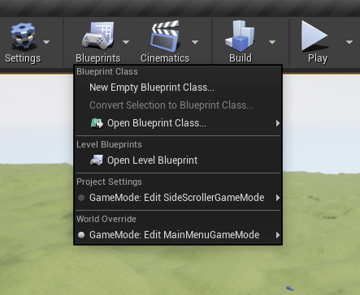
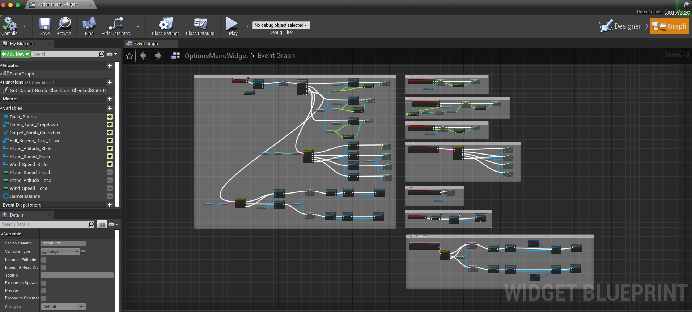
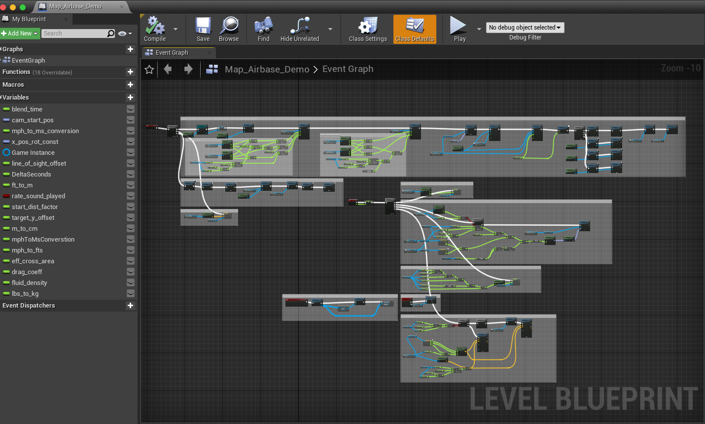

# Blueprints
Documented below are all the blueprints that are important to the simulation.
The source code contains other blueprints, but they are not important.

Below are all the blueprints we used to create the bombing sim. If you don't know
what blueprints are in unreal, we suggest you read [this](https://docs.unrealengine.com/5.0/en-US/blueprints-visual-scripting-in-unreal-engine/)
article first. Blueprints are a visual scripting tool in unreal.

## The Level Blueprints
To open the level blueprints, double click on the map file (this will open the level) then click the dropdown on the top toolbar for `Blueprints` and select `open level blueprint` 

### Main menu
This blueprint is located at `/Content/MainMenuBP/MainMenuLevel`.

This blueprint contains:
- Setup for main menu game mode
- Setup for view of main menu buttons (start button, options button, etc)

#### Main menu widget
This blueprint contains:
- Layout for all the buttons on the main menu
- Functionality regarding what each button does. To get to this, you need to select the `graph` button in the upper right.

#### Options menu widget
The options menu is technically in the main menu, just a different camera position.

This blueprint contains:
- Setup for all global variables used throughout the sim, including:
    - plane speed (rate)
    - plane altitude
    - wind speed (currently not implemented further than having it as an option)
    - bomb size (currently not implemented further than having it as an option)
    - multi bombs (carpet bombs)
    - fullscreen/multiscreen mode

### Gameplay level
This blueprint is pretty much the core of the simulation.

This blueprint is located at `/Content/MilitaryAirport/Maps/Map_Airbase_Demo`.

This blueprint contains:
- Camera animation for transitioning to scope view
- Getting global variables and using them to set initial plane altitude, carpet bombing, rate, etc)
- Setting the initial location of the B17 (plane)
- setting up 3 players for 3 screens each with their respective widget
- turn off collision with b17_bp and bombsight_Actor
- Playing the sounds of the instructor
- Saving the target location for accuracy calculation (actual accuracy calculation happens in the bomb blueprint)
- Relocating the side-view camera
- Updating the Line of Sight angle (LoS)
- Changing the camera angle according to rate and Y-pos inputs
- Calculating the drop angle based on user inputs
- Option for manually dropping the bomb
- Dropping the bomb when LoS == drop angle
- Ensuring the bomb explodes in case it does not "collide" with anything prior to the trigger box (on the target)
- predicting the trajectory of the bomb

Variables Include:
- `blend_time`: time to blend between cameras at the start of the level
- `cam_start_pos`: start rotation for the bombsight camera
- `Game Instance`: local copy of the global variables
- `line_of_sight_offset`: difference between drop angle and LoS angle to drop bomb
- `DeltaSeconds`: seconds between ticks
- `ft_to_m`: conversion factor from feet to meter
- `rate_sound_played`: boolean stating whether or not the rate sound effect played
- `start_dist_factor`: start distance factor for plane spawn (i.e. how far away to spawn the plane)
- `target_y_offset`: offset used to line up the plane with the target as the location of target is not necessarily in the middle of the object
- `m_to_cm`: conversion factor from m to cm
- `mphToMsConverstion`: conversion factor between mph to m/s
- `mph_to_fts`: conversion factor between mph and ft/s

#### Bombsight and Side View Rendering
It is to be noted that the widgets leverage a special ideology to implement. The idea was similar to how games (such as Call of Duty) create a snipe scope image. To do this, you need to have a SceneCapture2D actor. With this actor, you can attach a render target. The render target can then map to a material. Now, the widget can use an image box and attach the material to the image. This way you can bring up a widget that shows an image of some camera. 

### End menu
This blueprint is located at `/Content/EndMenuBP/EndMenuLevel2`.

This blueprint contains:
- Widget setup for play again and exit buttons
- Level setup (position of the camera)
- Determining what sound to play based on accuracy calculation
- Background end menu music

Variables include:
- `success_distance`: the distance that determines if you were close to the target

#### End menu widget
This blueprint contains:
- Layout for accuracy/simulation time
- Grabbing the global variables for accuracy and simulation time
- Buttons for play again and exit
- Logic for what each of those buttons does

## The Bomb Blueprint
This blueprint is located at `/Content/SideScrollerBP/model/bomb_shading_v005`.

The static mesh for this blueprint is located at `/Content/SideScrollerBP/model/bomb/bomb_shading_v005`

This blueprint contains:
- Logic for how the bomb should explode
- How the bomb should obey physics
- Logic for how the bomb should collide with things
- Calculating the accuracy (2D distance from the target object)

Variables Include:
- `ExplosionLength`: time for explosion
- `GameInstance`: local copy of global variables
- `m_to_cm`: conversion from meters to centimeters
- `m_to_ft`: conversion from meters to feet

## The GameInstance Blueprint
This blueprint is located at `/Content/simGameInstance`

This blueprint contains:
- All the global variables. These are: `distanceFromTarget`, `WindSpeed`, `Altitude`, `BombSize`, `PlaneSpeed`, `ToggleHUDInfo`, `ToggleManyBombs`, `ATF`, `Trail`, `Rate`, `drop_angle`, `line_of_sight_angle`, `timeInSim`, `target_vector`, `fudge_factor`, `Fullscreen`

As to what the variables are used for:
- `distanceFromTarget`: saves the location where the bomb lands in the simulation
- `WindSpeed`: a variable gathered from the options menu to be implemented into the game
- `Altitude`: a variable gathered from the options menu to move the plane to the proper height
- `BombSize`: a variable gathered from the options menu to adjust the weight of the bomb
- `PlaneSpeed`: a variable gathered from the options menu to adjust the speed of the plane
- `ToggleHUDInfo`: a variable gathered from the options menu intended to turn off the HUD information in the bombsight (i.e. bomb table inputs as well as rate, ATF, trail, and angles)
- `ToggleManyBombs`: a variable gathered from the options menu to trigger carpet bombing
- `ATF` (Actual Time of Fall), `Trail`, `Rate`: variables that are changed via user input and displayed on the bombsight widget
- `drop_angle` and `line_of_sight_angle`: variables that are calculated from where the player looks as well as from the player inputs
- `timeInSim`: saves the amount of time spent dropping the bomb in simulation
- `target_vector`: vector location of the target from simulation
- `fudge_factor`: AKA the scaling factor which scales the entire game down by this factor (setting to 1 will make game run on a realistic scale; setting to 10 will scale things down by a factor of 10)
- `Fullscreen`: determines how to display the game whether it is in windowed or fullscreen mode

## The B17 Blueprint

This blueprint is located at `/Content/GameAssets/b17_bp`. 

This blueprint contains:
- bomb bay doors opening
- the spawning bomb function
    - has carpet bomb function
    - has initial velocity function for the bomb
- propeller rotation on B17
- B17 movement

Variables Include:
- `ConstantValue`: value used to mess with the RPMs of the propellers
- `RPM`: the actual RPM value used for propeller rotation
- `Groundspeed`: speed of plane towards the target (will vary from True Airspeed when wind is applied)
- `GameInstance`: a copy of the global variables
- `DeltaSeconds`: a saved value of the time between ticks
- `mphToMsConverstion`: conversion factor between mph and m/s
- `bombZOffset`: distance from plane that bomb spawns
- `numBombs`: how many bombs to drop when carpet bombing
- `m_to_cm`: meters to centimeters conversion
- `bombXOffset`: distance forward or back the bomb spawns (used to put bomb spawn behind bomb bay doors)

### B17 Blueprint for Main Menu
Same location as above and essentially was made with far less funcitonality as the main menu plane should not move. Therefore, only the propellers move on this blueprint.

## The Bombsight Actor Blueprint
This blueprint is located at `/Content/SideScrollerBP/Blueprints/bombsight_blueprint`.

This blueprint contains:
- changing the line of sight (LoS) of the bomb sight
- playing an instructor sound for rate
- changing the rate from user input
- changing the ATF from user input
- changing the trail from user input

Variables include:
- `cameraMax`: max rotation for camera
- `cameraMin`: min rotation for camera
- `x_pos_rot_const`: amount to change camera LoS per tick of user rotary encoder
- `rate_sound_played`: boolean determining whether the rate sound was played or not
- `rate_adj`: how much to adjust rate per tick of user input
- `Game Instance`: local copy of global variables
- `rate_max`: max rate value
- `rate_min`: min rate value
- `ATF_adj`: how much to adjust ATF per tick of user input
- `ATF_max`: max ATF value
- `ATF_min`: min ATF value
- `Trail_max`: max trail value
- `Trail_min`: min trail value
- `Trail_adj`: how much to adjust trail per tick of user input

## Instructor Sounds
These are not necessarily blueprints, but they are necessary to mention as they add value to the simulation. These are located at `/Content/InstructorSounds/` and contain various voice lines from a Norden Instructional Video. 

