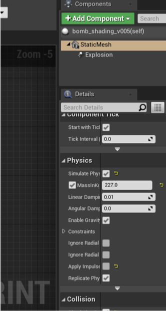

# Future Software Development

This page is dedicated to things that will need to be adjusted or added in software. 

## Carpet Bomb Accuracy

Currently the simulation takes the location of the first bomb dropped to calculate the accuracy. However, it should be taking the closest of all bombs dropped in order to calculate the accuracy.

To do this, some initial theorizing suggests that, when the bombs in the carpet bomb explode/collide with something, the location is saved to an array. This array should be saved to game instance. From that, when the end menu is loaded, a function iterates over the array to determine which location was the closest to the location of the target. Then, the widget displays the closest value to the target. 

## Course Correction due to Wind

When adding wind, there must also be a change in the direction the plane is facing in order to maintain realism. If there is a 90 degree crosswind at half the speed of the plane, the plane would have to turn into the wind in order to cancel that extra acceleration sideways. This could be done by changing the planes rotation value by a calculated amount based on wind speed. This adjusts the true heading of the plane. Performing vector math will be critical for this mimicry. This should allow the user to determine a drift angle (i.e. the angle at which the plane has to head/move to keep a straight course) which leads to wind calculations within the Norden.

Additionally, since any crosswind creates a crosstrail for the bomb, the plane's course will need to be adjusted. That is, the plane will have to move to a location where the cross trail will put the bomb onto the target. Since wind effects the bomb as well, the bomb will have a force that puts the bomb trajectory more diagonally instead of in line with the plane course. With the diagonal, there is a x-axis factor which needs to be taken into effect with the plane course. Therefore, the plane will have to move to the side to actually have the bomb land on the target.

## Bomb Drop Adjustments due to Wind and Gusts

Expanding on the above phenomenon, the bomb's trajectory will also be changed by the wind and therefore more adjustments will need to be made to the bombsight calculations. This also means that adjustments will need to be made to the bomb trajectory to include the force of the wind on the bomb.

## Plane Speed and Altitude Randomness

It was asked that we introduce randomness into the options set in the options menu. However, we were unable to achieve this due to time constraints. It is a fairly simple solution though. Simply take the selected value and use a random number function with a speicified range and add that value to the specified variables at the beginning of the simulation.

## Scaling and the Fudge Factor Fixes

After almost completing the functional basics of the simulation, it was found that the units in Unreal Engine were not in meters, rather the units are in centimeters. So, all calculations and variables are based on that assumption. To offset this, we created a fudge factor which scales these said variables to the proper values or by any scalar for that matter. However, if set to the proper scale, the map will need to be expanded drastically which we did not have time to implement.

At the time of this documentation, it was set for 10 which reduces the scale of the simulation by a factor of 10. To see what the scale should be for the simulation, change the fudge factor to 1. This is located in the sim game instance under the `Content` folder.

### Magnification

When the simulation is setup for fullscale (i.e. fudge factor = 1), it is hard to see the target at 14000 ft. Therefore, it is recommended that a magnification function be implemented. This can be done in software or there can be an additional input encoder to complete this action.

## Bomb Weight

It is to be noted that the bomb currently is set for 500 lbs regardless of the option selected in the options menu. In order to have the options menu take effect, you will have to go through the bomb blueprint and change the mass of the bomb in the physics option section. There should be an option for changing the mass in kg to any value you want.

This change in mass can be accomplished in two theoretic ways. One way is that when the bomb spawns that the mass get set based on the option selected. Another way is to create multiple bomb blueprint (each with their own respective weight), then spawn the one that correlates to the option selected.

## Dynamic Display

Within the Options Menu widget (`/Content/MainMenuBP/OptionsMenuWidget/`), there should be a function for the fullscreen and windowed effects. It is recommended that this function be further built on. The ideology behind this is that some 1920 x 1080 computers have different scalings within the display settings as in the image below.

Ideally, this function should find the screen size which may be bigger or smaller than 1920 x 1080 for if there is a small screen or 3 screens. In either case, you want the windowed function to dynamically map to the different screen resolutions. Right now, it is hard coded for a 1920 x 1080 screen. The windowed mode, as of the creation of this document, just decreases the height of the application so that it can fit 3 screens onto a 1920 x 1080 screen. Therefore, it makes the application a 1920 x 360 sized screen. There are issues with this functionality as the scaling and resolution within windows may change computer to computer which should be taken into account when performing the windowed action. 

## The Bombing Book

This will be re-iterated numerous times. Please take a look at the bombing book provided by the Museum of World War II Aviation in Colorado Springs. This is the source of all information leveraged in initial development. It will be confusing, but it is up to the designer to understand it for full implementation of the Norden Bombsight. Additional features for future development can be found throughout. 
