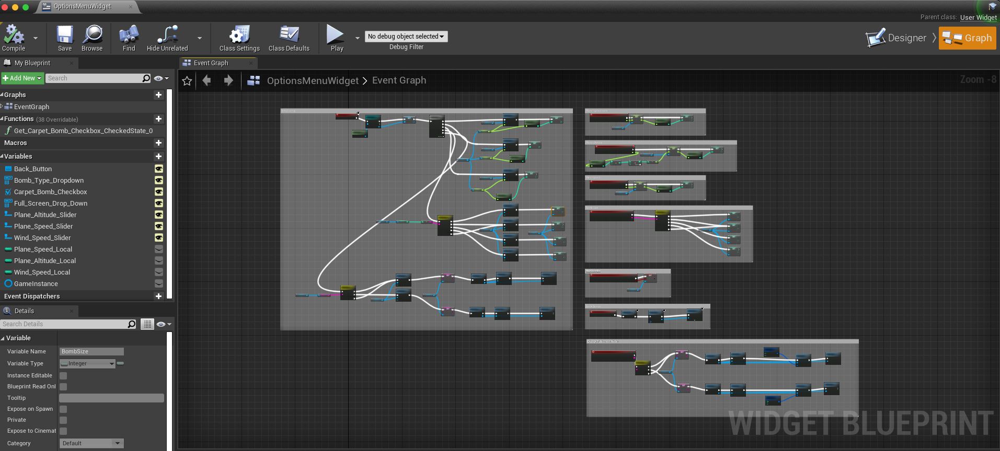
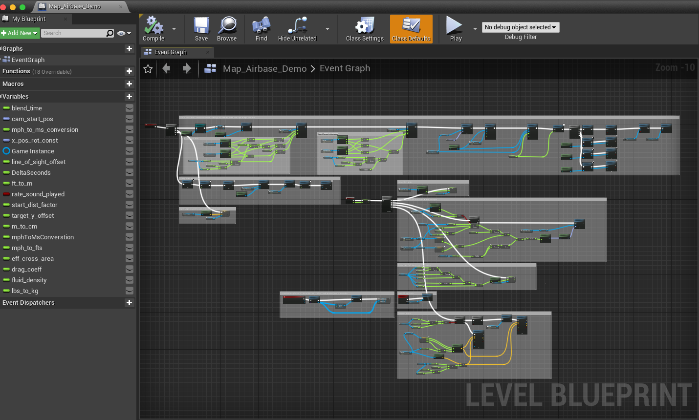

# Future Software Development
## Blueprints
Documented below are all the blueprints that are important to the simulation.
The source code contains other blueprints, but they are not important.

Below are all the blueprints we used to create the bombing sim. If you don't know
what blueprints are in unreal, we suggest you read [this](https://docs.unrealengine.com/5.0/en-US/blueprints-visual-scripting-in-unreal-engine/)
article first. Blueprints are a visual scripting tool in unreal.

### The Level Blueprints
To open the level blueprints, double click on the blueprint file (this will open
the level) then click the dropdown on the top toolbar for `Blueprints` and select
`open level blueprint` 

#### Main menu
This blueprint is located at `/Content/MainMenuBP/MainMenuLevel`.

This blueprint contains:
- Setup for main menu game mode
- Setup for view of main menu buttons (start button, options button, etc)

##### Main menu widget
This blueprint contains:
- Layout for all the buttons on the main menu
- Functionality regarding what each button does. To get to this, you need to select the `graph` button in the upper right.

##### Options menu widget
The options menu is technically in the main menu, just a different camera position.

This blueprint contains:
- Setup for all global variables used throughout the sim, including:
    - plane speed (rate)
    - plane altitude
    - wind speed (currently not implemented further than having it as an option)
    - bomb size (currently not implemented further than having it as an option)
    - multi bombs (carpet bombs)
    - fullscreen/multiscreen mode

#### Gameplay level
This blueprint is pretty much the core of the simulation.

This blueprint is located at `/Content/MilitaryAirport/Maps/Map_Airbase_Demo`.

This blueprint contains:
- Camera animation for transitioning to scope view
- Getting global variables and using them to set initial plane altitude, carpet bombing, rate, etc)
- Setting the initial location of the B17 (plane)
- Playing the sounds of the instructor
- Saving the target location for accuracy calculation (actual accuracy calculation happens in the bomb blueprint)
- Relocating the side-view camera after the bomb drop
- Updating the Line of Sight angle (LoS)
- Changing the camera angle according to rate and X-pos inputs
- Calculating the drop angle based on user inputs
- Option for manually dropping the bomb
- Dropping the bomb when LoS == drop angle
- Ensuring the bomb explodes in case it does not "collide" with anything prior to the trigger box (on the target)

#### End menu
This blueprint is located at `/Content/EndMenuBP/EndMenuLevel2`.

This blueprint contains:
- Widget setup for play again and exit buttons
- Level setup (position of the camera)
- Determining what sound to play based on accuracy calculation
- Background end menu music

##### End menu widget
This blueprint contains:
- Layout for accuracy/simulation time
- Grabbing the global variables for accuracy and simulation time
- Buttons for play again and exit
- Logic for what each of those buttons does

### The Bomb Blueprint
This blueprint is located at `/Content/SideScrollerBP/model/bomb_shading_v005`.

The static mesh for this blueprint is located at `/Content/SideScrollerBP/model/bomb/bomb_shading_v005`

This blueprint contains:
- Logic for how the bomb should explode
- Imparting initial velocity to the bomb (matching current plane velocity)
- How the bomb should obey physics
- Logic for how the bomb should collide with things
- Calculating the accuracy (2D distance from the target object)

### The GameInstance Blueprint
This blueprint is located at `/Content/simGameInstance`

This blueprint contains:
- All the global variables. These are: `distanceFromTarget`, `WindSpeed`, `Altitude`, `BombSize`, `PlaneSpeed`, `ToggleHUDInfo`, `ToggleManyBombs`, `ATF`, `Trail`, `Rate`, `drop_angle`, `line_of_sight_angle`, `timeInSim`, `target_vector`, `fudge_factor`, `Fullscreen`
