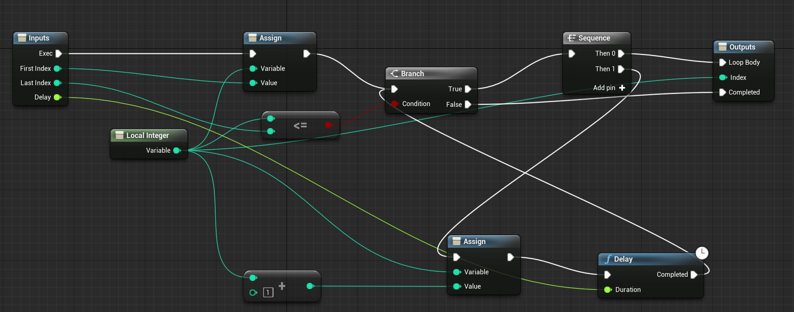

# Vyn's Macro Libray
This library was built for the sole purpose of adding a delay to a for loop. Adding a delay to a for loop in unreal is not straightforward and requires stubbing out the current unreal for loop implementation.

The file for this macro is located under the `Content` folder.
