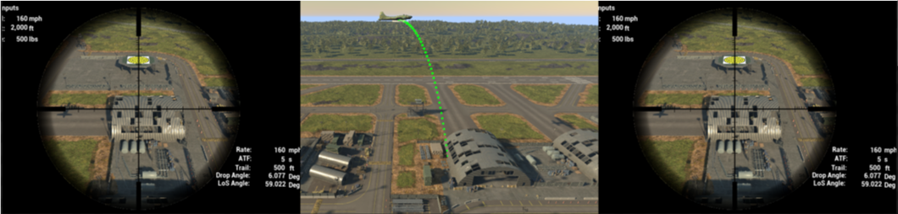

# System Setup

This page will discuss setting up the computer with the proper controllers and downloading the Norden Bombsight simulation software.

## Hardware Setup

This section will discuss hardware requirements for different pieces as well as connecting to the bombsight. 

### Computer Requirements

To begin, it is necessary to have a computer capable of 4 display outputs. This implies that there will also be 4 displays. The main reason for this is to display the bombsight view within the bombsight and on an external monitor as well as displaying a 3D view of the plane and projected bomb trajectory. The fourth monitor is used for educational material to talk about the Norden Bombsight.

On top of monitor support, the computer will also require at least 8 GB of RAM as well as have a quad-core processor. 

For compatability, the computer should have DirectX11 or 12 compatibility as of the date of this document (April 2022). The computer should also have USB ports.

For graphics, it is recommended to at least have an NVIDIA GeForce GTX 970 or better GPU. 

### Monitors

As discussed above, there are 4 monitors within the setup. The 3 exterior monitors are suggested to be 27" or larger for spectators to view. 

The interior monitor is a small 5" monitor within the bombsight replica itself. All monitors should have 1080p resolution. 

### User Input

For the final piece of the puzzle, the bombsight has an external box as of the creation of these documents (April 2022). This external box should have a USB cable falling out of it that can be plugged directly into the computer. 

### Conclusion 

If you follow the above procedure, the hardware should be setup for basic functionality. 

## Software Setup

For the software setup, there should be a flash drive that the executable (as well as all the development files) is saved on. If not done so already, make sure the executable gets transferred to the computer. 

(insert image here of flash drive contents and location of executable)

Once the executable is transferred, you should be able to click on the executable to begin the simulation. 

(insert image here of executable)

While in the start menu, you have two options. First option is that you may go to the options menu and ensure the setting says fullscreen. Then drag the window for the executable across all 3 necessary display screens. This may be better if some software fixes are made to the system to allow for better separation of the 3 splitscreens. The second option consist of changing the same setting in the options menu to the windowed option. This will section the simulation into three windows which will help see where the 3 screens are for later. Then adjust the size of the screen to fill the display screens. The windowed option is recommended as of the date of this document.

This should conclude software setup. 

